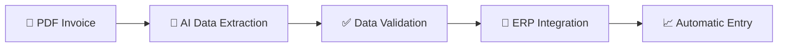

<!-- Typing animation -->

<!-- Social badges -->

  
  

---

## 🎓 About me

I'm a beginner in the programming field, currently focused on building a solid foundation in programming logic and software development. I'm at the start of my journey, but I already have a clear goal: combining programming and artificial intelligence to solve real everyday problems in professional environments, especially around automating administrative and financial processes.

Current practice: small exercises and experiments in Google Colab notebooks, where I've been testing basic Python concepts before structuring more complete projects.

  

---

## 🧰 Stack & Technologies

### Current proficiency

  

### Actively studying

  
  
  
  

> 📌 *This README will be updated as I progress in my studies and add new technologies to my skill set.*

---

## 🚀 Project in development

My main study goal right now is to gather enough knowledge to build the following project:

### 📄 AI-Powered PDF Reader for Service Invoices

An application capable of **automatically reading and transcribing service invoices (NFS-e) in PDF format**, using artificial intelligence for data extraction, and **posting that information directly into an ERP system**, eliminating the need for manual data entry.

| | |
|---|---|
| 🎯 **Motivation** | Automate a repetitive, error-prone process, applying concepts of Python, document/text processing, and systems integration |
| 🔧 **Key technologies (planned)** | PDF parsing, AI for text/data extraction, ERP API integration |
| 📊 **Status** |  |

---

## 📂 Repositories

I don't have structured public repositories yet — my current studies are concentrated in Google Colab notebooks. My first hands-on projects will be published here soon, including the initial steps of the AI-powered PDF reader project.

---

## 🌱 Development interests

- 🤖 Artificial Intelligence applied to process automation
- 📄 Document data extraction and processing (PDF)
- 🔗 Systems integration (ERP and APIs)
- 📈 Good programming practices and continuous growth as a developer

---

## 📊 GitHub Stats

  
  

  

---

## 📫 Contact

  
  

  

---

  <i>README created as part of an academic project on professional profile documentation on GitHub.</i>

